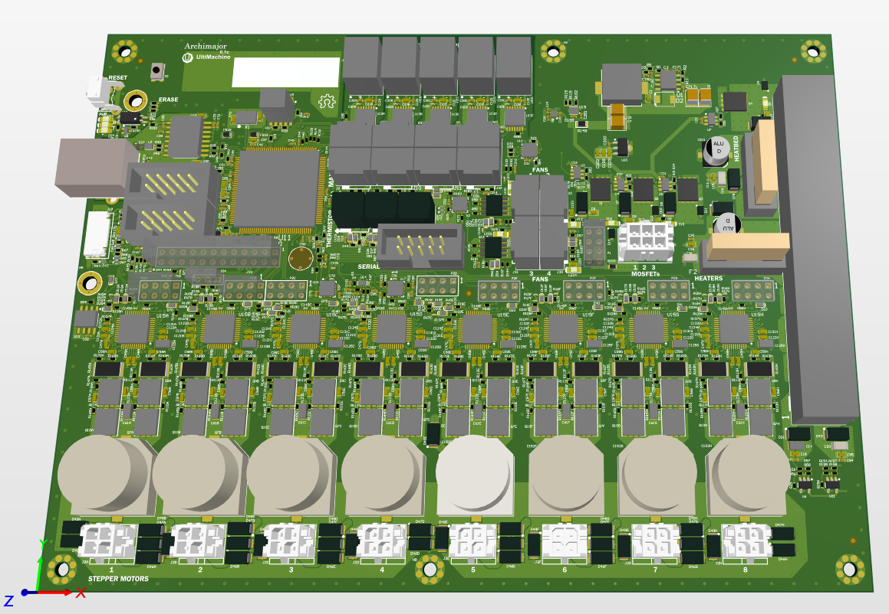

**Note**: The information contained below does not necessarily reflect the design intent for this board, nor the true characteristics of the design. Rather, this is intended to be a proof of concept for electrical project architecture.

[-yellow?style=for-the-badge)](./.allspice/Archimajor.bom.csv)

[*](./README.md#Disclaimer)

# Archimajor

## Summary

3D printer motherboard, designed by [Ultimachine](https://ultimachine.com/). Features include:

- **5x integrated 256 microstep motor drivers**
- **6x PWM Mosfet outputs**
- **4x thermistor inputs**
- **SPI (Serial Peripheral Interface)**

---

## Specifications

### General Specifications

**Input Power Supply**: 12V - 24V DC, 16A+

**Operating Temperature Range (est.)**: 0dC ~ 70dC

## Firmware

[Source](https://github.com/ultimachine/Marlin4due/tree/Archim2)

[Binary](https://github.com/MarlinFirmware/Marlin/archive/bugfix-2.0.x.zip)

## Bill of Materials

    
<b>[Click to show Bill of Materials]</b>

| Description | Designator | Footprint | Quantity | MANUFACTURER # |
|-------------|------------|-----------|----------|----------------|
| CAP CER 0603 100nF 50V 10% X7R | C1, C15, C18, C23A, C23B, C23C, C23D, C23E, C36, C47A, C47B, C47C, C47D, C47E, C47F, C47G, C47H, C95, C121A, C121B, C121C, C121D, C121E, C121F, C121G, C121H, C122A, C122B, C122C, C122D, C122E, C122F, C122G, C122H, C199, C202, C203 | C0603 | 37 | C0603C104K5RACTU |
| CAP CER 0.1UF 6.3V 10% X5R 0201 | C2, C60A, C60B, C60C, C60D, C60E, C62A, C62B, C62C, C62D, C62E, C67, C78, C91, C100, C105, C106, C149A, C149B, C149C, C149D, C149E, C149F, C149G, C149H, C204, C205, C206, C207, C208, C215, C217 | C0201 Large Pads | 32 | CL03A104KQ3NNNC |
| CAP CER 0402 TBD | C3 | C0402 | 1 | TBD |
| CAP CER 47UF 10V X5R 1210 | C4, C5 | C1210 | 2 | GRM32ER61A476KE20L |
| CAP CER 4.7UF 50V X7R 1210 | C6, C7 | C1210 | 2 | GRM32ER71H475KA88L |
| Capacitor Non Polarized | C8, C9, C10, C11, C27, C50, C153, C154, C209, C211 | C0603 | 10 | DNI-C0603TBD |
| CAP CER 10nF 50V X7R 0402 | C12A, C12B, C12C, C12D, C12E, C30A, C30B, C30C, C30D, C30E, C40, C43, C71, C77, C84, C86, C157, C158, C159, C160, C171, C214, C216 | C0402 | 23 | GRM155R71H103JA88D |
| 1000pF 50V Ceramic Capacitor X7R 0402 (1005 Metric) 0.039 L x 0.020 W (1.00mm x 0.50mm) | C13, C17, C35, C94 | C0402 | 4 | GRM155R71H102KA01D |
| CAP CER 10UF 50V 10% X5R 1206 | C14, C16, C38, C93 | C1206 | 4 | 490-10756-2-ND |
| CAP CER 0402 100nF 16V 10% X7R | C19, C20, C21, C22, C26, C28, C29, C31, C33, C39, C44, C45, C46, C51, C52, C54, C56, C63, C65, C66, C68, C69, C73, C76, C80, C81, C82, C92, C103, C155, C156, C161, C162, C164, C165, C166, C167, C169, C200, C201, C212, C213 | C0402 | 42 | GRM155R71C104KA88D |
| CAP CER 0402 1uF 6.3V 10% X5R | C24, C32, C34 | C0402 | 3 | GRM155R60J105KE19D |
| CAP ALUM 100UF 35V 20% SMD | C25, C210 | CAP-ELEC-063063077 | 2 | UWT1V101MCL1GS |
| CAP CER 10UF 6.3V 10% JB 0603 | C37, C53, C55, C57, C70, C72 | C0603 | 6 | C1608JB0J106K080AB |
| CAP CER 3PF 50V NP0 0603 | C41, C42 | C0603 | 2 | CL10C030BB8NNNC |
| CAP CER 0.22UF 50V X7R 0603 | C48A, C48B, C48C, C48D, C48E, C48F, C48G, C48H, C59A, C59B, C59C, C59D, C59E, C59F, C59G, C59H, C98A, C98B, C98C, C98D, C98E, C98F, C98G, C98H, C99A, C99B, C99C, C99D, C99E, C99F, C99G, C99H | C0603 | 32 | CGA3E3X7R1H224K080AB |
| CAP CER 10PF 50V 5% NP0 0402, 470nF 6.3v C0402 - GRM155R60J474KE19D | C49, C132A, C132B, C132C, C132D, C132E, C132F, C132G, C132H | C0402 | 9 | CL05C100JB5NNNC, GRM155R60J474KE19D |
| CAP CER 0603  1nF 50v 10% X7R | C58A, C58B, C58C, C58D, C58E, C58F, C58G, C58H, C96A, C96B, C96C, C96D, C96E, C96F, C96G, C96H, C97A, C97B, C97C, C97D, C97E, C97F, C97G, C97H, C123A, C123B, C123C, C123D, C123E, C123F, C123G, C123H | C0603 | 32 | C0603C102K5RACTU |
| CAP CER 1206 4.7uF 50V 10% X5R | C61A, C61B, C61C, C61D, C61E, C61F, C61G, C61H, C125A, C125B, C125C, C125D, C125E, C125F, C125G, C125H | C1206 | 16 | C1206C475K5PACTU |
| CAP CER 0402 TBD | C64, C74, C75, C79, C83, C85, C87, C88, C89, C90, C101, C102, C104 | C0402 | 13 | TBD |
| CAP CER 0.022UF 100V X7R 0603 | C124A, C124B, C124C, C124D, C124E, C124F, C124G, C124H | C0603 | 8 | C0603C223K1RACTU |
| CAP CER 4.7UF 6.3V X7R 0603 | C131A, C131B, C131C, C131D, C131E, C131F, C131G, C131H | C0603 | 8 | CL10B475KQ8NQNC |
| CAP CER 0402 2.2nF 25V C0G | C150 | C0402 | 1 | C0402C222J3GACTU |
| CAP CER 0402 22pF 50V 5% C0G | C151 | C0402 | 1 | 04025A220JAT2A |
| CAP ALUM 470UF 20% 50V SMD | C152A, C152B, C152C, C152D, C152E, C152F, C152G, C152H | CAP16x17 | 8 | UCZ1H471MNQ1MS |
| Capacitor Non Polarized | C198 | C0402 | 1 | DNI-C0402TBD |
| TVS DIODE 3.3VWM 10.4VC SOD923 | D1, D3, D13, D32, D33, D34, D35, D42, D58, D59, D64, D65, D66, D67, D68, D69, D71, D72, D73 | SOD923-100X40-2N | 19 | ESD9X3.3ST5G |
| DIODE SCHOTTKY 40V 5A SMB_DO214AA | D2 | SMB_DO-214AA_LRG | 1 | SK54B-LTP |
| DIODE TVS | D4, D10, D11, D14, D26 | SOD323-R | 5 | RSB39VTE-17 |
| DIODE SCHOTTKY 30V 200MA SOD523 | D5, D12A, D12B, D12C, D12D, D12E, D12F, D12G, D12H, D19A, D19B, D19C, D19D, D19E, D19F, D19G, D19H, D20A, D20B, D20C, D20D, D20E, D20F, D20G, D20H, D28, D29, D30, D31, D36, D37, D38, D39, D40, D41, D50, D51, D52, D53, D54, D55, D56, D57, D60, D61, D62, D63, D70, D74, D75, D76, D77 | SOD523_IPC | 52 | BAT54WX-TP |
| DIODE Schottky 3A SMA | D6, D7, D8, D15 | SMA-SM | 4 | SK310A |
| LED 0805 Red | D9, D16, D17, D18, D24, LED1, LED2, LED3, LED4 | LED2012120 | 9 | 5988110107F |
| TVS DIODE 24V 38.9V SMA | D21, D22, D43, D46A, D46B, D46C, D46D, D46E, D46F, D46G, D46H, D47A, D47B, D47C, D47D, D47E, D47F, D47G, D47H, D48A, D48B, D48C, D48D, D48E, D48F, D48G, D48H, D49A, D49B, D49C, D49D, D49E, D49F, D49G, D49H, D78 | SMA-SM | 36 | SMAJ24A |
| LED 0805 Green | D23 | LED2012120 | 1 | 5988170107F |
| LED 0805 Yellow | D25 | LED2012120 | 1 | 5988140107F |
| Rail-to-rail ESD protection devices | D27 | SOT886 | 1 | PRTR5V0U2F,115 |
| TVS DIODE 3.3VWM 10.4VC SOD923 | D44 | SOD923-D | 1 | ESD9X3.3ST5G |
| TVS DIODE 5V 9V SOD923 | D45 | SOD923-D | 1 | DF2S6.8FS,L3M |
| FUSE PTH ATO | F1, F2 | 3557 | 2 | 3557-2 |
| FERRITE BEAD 120 OHM 0603 1LN | FB26, FB27, FB28, FB29, FB30 | FB0603 | 5 | CIS10P121AC |
 | | FD1, FD2, FD3, FD4, FD5, FD6, FD7 | FIDUCIAL-1X2 | 7 | NOTAPART-Fiducial |
| Conn - 3mm Pitch Fixed | J1 | 43045-0612 | 1 | 0430450612 |
| Conn - 3mm Pitch Fixed | J2A, J2B, J2C, J2D, J2E, J2F, J2G, J2H | 43045-0412 | 8 | 43045-0412 |
| CONN BARRIER STRIP 10CIRC 0.325 | J3 | CON-Barrier-10-8.26mm | 1 | 4DB-P108-10 |
| 20021121-00010C4LF | J4 | FTSH-105-XX-X-DV | 1 | 20021121-00010C4LF |
| 3 Positions Header, Shrouded Connector 0.100 (2.54mm) Through Hole Gold - Pin in Paste | J5, J6, J7, J9, J10, J11, J22, J29, J30, J31, J32, J33 | 70543-02 PIN-IN-PASTE | 12 | 0705430002 |
 | | J8 | PN61729 | 1 | 61729-0010BLF |
| CONN HEADER VERT 10POS GOLD | J12, J13, J28 | HDR2X5 IDC | 3 | 302-S101 |
| Connector 2pos - Pin in Paste | J14, J15, J16 | 70543-01 PIN-IN-PASTE | 3 | 0705430001 |
| microSD 0475710001Molex Part | J18 | SD_MICRO 475710001 | 1 | 0475710001 |
| Header, 12-Pin, Dual row | J20 | HDR2X12 | 1 | 2213S-24G |
| TERM BLOCK 2POS 45DEG 3.5MM PCB | J21A, J21B, J21C, J21D, J21E | 1864286 | 5 | 1864286 |
| Header 3Pin 1Row T-Hole | J24 | HDR3X1 | 1 | 2211S-03G |
| FIXED IND 4.7UH 10A 15.5 MOHM | L1 | IND_10X10 | 1 | SRP1038A-4R7M |
| Common Mode Chokes Dual 90Ohm 100MHz 330mA 350mOhm DCR SMD | L5 | DLW21HN900SQ2L | 1 | DLW21HN900SQ2L |
| Header, 4-Pin, Dual row | P1, P2A, P2B, P2C, P2D, P2E, P2F, P2G, P2H | HDR2X4 | 9 | 2213S-08G, [NoParam] |
| MOSFET N-CH 40V 100A 8VSON | Q1, Q2, Q3, Q4 | SOT669_Universal | 4 | CSD18503Q5A |
| 40V 17 MOHM T6 S08FL DUAL | Q7A, Q7B, Q7C, Q7D, Q7E, Q7F, Q7G, Q7H, Q9A, Q9B, Q9C, Q9D, Q9E, Q9F, Q9G, Q9H, Q10A, Q10B, Q10C, Q10D, Q10E, Q10F, Q10G, Q10H, Q11A, Q11B, Q11C, Q11D, Q11E, Q11F, Q11G, Q11H | SO8FL-Dual | 32 | NVMFD5C478NT1G |
| TRANS NPN 60V 0.2A SOT523 | Q8 | SOT523 SMALL | 1 | MMBT3904T-7-F |
 | | Q12, Q13 | NCV8402AD-SOIC8 | 2 | NCV8402ADDR2G |
| RES SMD 10.2K OHM 1% 1/16W 0402 | R1 | R0402 | 1 | RC0402FR-0710K2L |
| RES SMD 1.4K OHM 1% 1/16W 0402 | R2 | R0402 | 1 | RMCF0402FT1K40 |
| RES 47 OHM 1% 1/16W 0402 | R3, R4, R13, R32, R59, R84, R86A, R86B, R86C, R86D, R86E, R86F, R86G, R86H, R88A, R88B, R88C, R88D, R88E, R89, R93, R94, R116A, R116B, R116C, R116D, R116E, R116F, R116G, R116H, R163A, R163B, R163C, R163D, R163E, R163F, R163G, R163H, R168A, R168B, R168C, R168D, R168E, R168F, R168G, R168H, R170A, R170B, R170C, R170D, R170E, R170F, R170G, R170H | R0402 | 54 | CRCW040247R0FKEDC |
| RES SMD 1.96K OHM 1% 1/16W 0402 | R5 | R0402 | 1 | RC0402FR-071K96L |
| RES SMD 10K OHM 1% 1/16W 0402 | R6, R7, R8, R9, R11, R12, R14, R15, R29, R30, R39, R54, R56, R64, R65, R66, R67, R68, R69, R70, R85, R95, R96, R97, R100, R101, R119, R150, R151, R155, R171, R182, R183 | R0402 | 33 | RC0402FR-0710KP |
| RES SMD 37.4K OHM 1% 1/16W 0402 | R10 | R0402 | 1 | RC0402FR-0737K4L |
| RES SMD 4.7K OHM 1% 1/16W 0402 | R16A, R16B, R16C, R16D, R16E, R16F, R16G, R16H, R18A, R18B, R18C, R18D, R18E, R18F, R18G, R18H, R62, R80, R90 | R0402 | 19 | RC0402FR-074K7L |
| Resistor | R17A, R17B, R17C, R17D, R17E, R17F, R17G, R17H, R60 | R0402 | 9 | DNI-R0402TBD |
| RES 0402 1k 63mW 1%, RES SMD 1K OHM 1% 1/16W 0402 | R19, R23, R33, R34, R36, R40, R41, R71, R72, R74, R76, R79, R102, R108A, R108B, R108C, R108D, R108E, R108F, R108G, R108H, R152, R174, R175, R176, R177, R186, R187, R188, R189, R191, R193, R197, R198 | R0402 | 34 | RC0402FR-071KL |
| RES SMD 100 OHM 1% 1/16W 0402 | R20, R21, R25, R53, R98, R99, R109, R114, R120, R133, R134, R135, R136, R137, R138, R139, R140, R141, R142, R143, R144, R145, R149, R153, R159, R160, R161, R180, R181 | R0402 | 29 | RC0402FR-07100RL |
| RES SMD 100K OHM 1% 1/16W 0402 | R22, R31, R35, R37, R38, R51, R58, R63, R73, R75, R78, R158, R190, R192 | R0402 | 14 | RC1005F104CS |
| RES SMD 10 OHM 1% 1/16W 0402 | R24, R27, R52, R55, R110A, R110B, R110C, R110D, R110E, R110F, R110G, R110H, R111A, R111B, R111C, R111D, R111E, R111F, R111G, R111H, R112A, R112B, R112C, R112D, R112E, R112F, R112G, R112H, R113A, R113B, R113C, R113D, R113E, R113F, R113G, R113H, R164A, R164B, R164C, R164D, R164E, R164F, R164G, R164H, R165A, R165B, R165C, R165D, R165E, R165F, R165G, R165H, R166A, R166B, R166C, R166D, R166E, R166F, R166G, R166H, R167A, R167B, R167C, R167D, R167E, R167F, R167G, R167H | R0402 | 68 | RC0402FR-0710RL |
| RES SMD 24K OHM 1% 1/16W 0402 | R26, R154 | R0402 | 2 | CRCW040224K0FKEDC |
| RES 0402 1M 100mW 5% | R28, R156 | R0402 | 2 | ERJ2GEJ105X |
| Res Thick Film 0402 24 Ohm 1% 0.063W | R42, R43, R45, R46, R47, R48, R77, R82, R83 | R0402 | 9 | RC0402FR-0724RL |
| RES SMD 2.37K OHM 1% 1/16W 0402 | R44, R50, R81, R87, R91, R92 | R0402 | 6 | RC0402FR-072K37L |
| RES SMD 6.8K OHM 1% 1/16W 0402 | R49 | R0402 | 1 | CRCW04026K80FKED |
| RES SMD 130K OHM 5% 1/16W 0402 | R57, R157 | R0402 | 2 | RC0402JR-07130KL |
| RES 0402 1M 100mW 5% | R61 | R0402TBD | 1 | ERJ2GEJ105X |
| RES SMD 0.0OHM JUMPER 1/10W 0603 | R103 | R0603 | 1 | CR0603-J/-000ELF |
| RES SMD 2.2 OHM 5% 1/16W 0402 | R107A, R107B, R107C, R107D, R107E, R107F, R107G, R107H | R0402 | 8 | RC0402JR-072R2L |
| RES SMD 15K 1% 1/16W 0402 | R115 | R0402 | 1 | RC1005F153CS |
| RES 0.01 OHM 1% 1/2W 0805 | R148 | R0805 | 1 | KRL1220E-M-R010-F-T5 |
| RES 0.05 OHM 1% 2W 2512 | R162A, R162B, R162C, R162D, R162E, R162F, R162G, R162H, R169A, R169B, R169C, R169D, R169E, R169F, R169G, R169H | R2512 | 16 | CSRN2512FK50L0 |
| RES SMD 1.8K OHM 1% 1/16W 0402 | R172, R173, R184, R185 | R0402 | 4 | RC0402FR-071K8L |
| VARISTOR 6.8V 10A 0201 | RV1, RV2, RV3, RV4, RV5A, RV5B, RV5C, RV5D, RV5E, RV5F, RV5G, RV5H, RV6A, RV6B, RV6C, RV6D, RV6E, RV6F, RV6G, RV6H, RV7A, RV7B, RV7C, RV7D, RV7E, RV7F, RV7G, RV7H | C0201 Large Pads | 28 | AVRM0603C6R8NT101N |
| SWTCH Momentary Washable | S1 | B3F-31XX | 1 | 1571610-2 |
| SWITCH TACTILE SPST-NO 0.05A 12V | S2 | KMR 6 Series | 1 | KMR741NG ULC LFS |
| IC REG BUCK ADJ 5A 8SOPWRPAD | U1 | SOIC127P600X170_HS | 1 | TPS54531DDAR |
| Quadruple Bus Buffer Gates With 3-State Outputs 14-VQFN -40 to 125 | U2, U10 | QFN50P350X350X100 | 2 | SN74AHCT125RGYR |
| MOSFET DRVR 3A 1-OUT High Speed Non-Inv6-Pin SOT-26 T/R | U3, U4, U5, U7 | SOT26P285X140 | 4 | ZXGD3009E6TA |
| IC QUAD DIFF COMPARATOR 14 -SOIC | U6, U21 | SOT23-5 | 2 | AP331AWG-7 |
| LDO 3.3V 500mA - low ESR Cout | U8 | TDFN1616-6LD-PL-1 | 1 | MIC5353-3.3YMT-TR |
| USB Opto Isolator | U9 | ADuM4160 | 1 | ADUM3160BRWZ-RL |
| Atmel | U11 | LQFP144_N | 1 | ATSAM3X8EA-AU |
| IC FLASH 16M SPI 104MHZ 8SOIC | U12 | S25FL216K0PMFI041 | 1 | AT25SF161-SSHD-T |
| IC CONV THERMOCOUPLE 14TSSOP | U13A, U13B, U13C, U13D, U13E | TSSOP-14L 65P640X110 | 5 | MAX31856MUD |
| Clock Fanout Buffer (Distribution) IC 1:4  8-XFDFN | U14 | XSON50P100X50-8L | 1 | 74AVC9112GTX |
| IC STEPPER MOTOR DVR TQFP48-EP | U15A, U15B, U15C, U15D, U15E, U15F, U15G, U15H | TQFP48-EP | 8 | TMC5160-TA |
| IC BUS BUFF TRI-ST QD 14VQFN | U16, U17 | PVQFN14_3.5X3.5 | 2 | SN74LVC125ARGYR |
| Optoisolator Transistor Output 3750Vrms 1 Channel 4-SO | U18 | SO-4 | 1 | TLP293(TPL,E |
| IC COMPARATOR BIDIR 8WSON | U19 | WSON8_2x2mm | 1 | INA381A2IDSGR |
| IC REG LINEAR 5V 100MA SOT89-3 | U20 | SOT-89-3 | 1 | L78L05ABUTR |
| Crystal 12MHz ±30ppm (Tol) ±50ppm (Stability) 13pF FUND 50Ohm | X1 | CRYS320500 | 1 | 405C35B12M00000 |

## Disclaimer

*NOTE: This does not represent actual data from the Rambo/Archimajor PCBA
